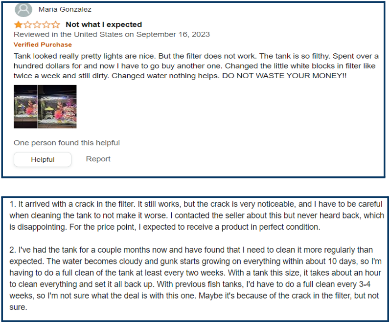

# Smart-Fish-Aquarium

 Fish keeping has become a widespread hobby and decorative trend, with people of all ages maintaining fish in various settings such as homes, offices, and commercial fish farms. There are difficulties to maintain a perfect condition for the fish to live. Coming across different peoples there are fish farmers, students, those who are in jobs etc. This group of people finds it hard to look after their aquariums or fish growing tanks due to different reasons. Due to this,  needful conditions for the fish to thrive are not given. To address the challenges of manually monitoring and maintaining aquariums, an IoT-connected system is presented. This system uses electronics to automate and control the aquarium's environment, including water conditions, lighting, automatic feeding, water filtering and water aeration. It communicates real-time status updates to a user's smartphone, significantly reducing the manual effort required for aquarium maintenance. The project helps people to access their aquariums or fish tanks from a part of the world, which helps fish farmers to look after their tanks on their own, which saves the labor charge to be given for the maintenance, with this anyone can plan for their business trips or leisure trips without being concerned about their fishes. The project utilizes an esp8266 WiFi based microcontroller as the system's control center, storing and transmitting data to a user via an Android app. This setup includes sensors for monitoring water temperature, actuators for providing wireless feeding, control to filters and lighting conditions. The command from mobile and the values from sensors are communicated to each other with the help of web servers. The result of this project aims to automation of an aquarium to make it available for users to control it in real time from any part of the world. 

# 1. What is this system?

 Increased pet ownership in India, particularly addressing the challenges faced by fish owners in leaving extra food, leading to overfeeding and fish fatality, also the unchecked conditions of the aquarium. The project aims to ensure proper fish growth and maintenance, design an automatic fish feeder, and provide real-time monitoring for aquarium, automatic tank mold cleaning, all connected to mobile applications. Pet ownership in India has seen a 14% increase over the past 29 years. For fish owners, leaving extra food in the tank during extended absences isn't feasible and can lead to overfeeding. The breakdown of excess food releases harmful substances like ammonia and nitrites, reducing oxygen levels in the water. While various feeding options exist for cats and dogs, fish owners have fewer choices. Natural food in ponds includes detritus, bacteria, and plankton, making it challenging to determine the proper amount of artificial food. This project addresses these challenges by designing an automated system that monitors water temperature, quality, cleaning and facilitates automatic fish feeding in aquaculture environments. The solutions available now are basic projects with Arduino. The products available in the market are costly. The aim of the project is to implement these functionalities at a reduced cost, also with advanced microcontrollers. Use of microcontrollers like stm32 or LPC2129 provides much faster clock speeds and faster I/O operations. Power consumption is also taken into consideration. 

# 2. Methodology

 This project helps us to feed, aerate or even control the light conditions of the aquarium from anywhere. The system includes three sockets that allow users to connect various components of their aquarium. The mobile app (Blynk IoT) is linked with the system for communication between user and components. The functions can be customisable i.e. if the user has to connect a secondary filter to the aquarium using the application, then the available sockets can be used to connect any components. It draws main power from the 240V household source, therefore any components with capability of handling 240V can be connected. 

# 3. Feedback survey

 
3.1 Literature Survey   
            Objective of the paper titled “ Aquarium Monitoring System Based on Internet of Things” defines the purpose of the system is to monitor and optimize the environment in an aquarium. It focuses on parameters such as temperature, light intensity, and water level. Components include temperature, light, ultrasonic, and infrared modules.It processes sensor data to control and optimize various outputs (e.g., lighting, water pumps) using data fusion calculations. An automatic feeder with a servo motor is integrated into the system. The feeder ensures timely and controlled feeding for the fish. Data Upload and Monitoring: Sensor data is uploaded to a back-end computer via the built-in Wi-Fi of the LinkIt 7697 module. The Cloud Sandbox platform provides real-time monitoring and enables remote network monitoring of the aquarium. In summary, this smart aquarium system combines technology, automation, and real-time monitoring to create a comfortable and safe environment for pet fish. The above proposed system is a similar system to our product.

3.2 Aquarium shop
             The review shared by the shopkeeper is that the customers who were buying the fishes were coming frequently to buy another pair, because before bought pairs were dead. Shopkeeper asked reviews about the fish and customers said that the fish were healthy but the conditions in which they lived did not help them to survive.He added another point that the existing systems were costly and people are not interested in buying those for high prices. Shopkeeper also acknowledged that the customers were not aware about the conditions for fishes to live and would carelessly drag them to death.

3.3 Review from customer
           The review shared by the customer was that he had a fish aquarium in his room but has removed it recently due to water spillage while cleaning the tank. The room went messy, each time they cleaned the aquarium. He also pointed out that a fully automated system would help to install an aquarium again, such that aquarium maintenance would be easier parallel with daily life. 

3.4 Review from fish farm owner
              The common problem faced is when cleaning is not done frequently, fish excretions and food wastes get accumulated at the bottom of the tank. Due to this the PH level of the water changes and the water purity decreases such that it cant be used anymore to grow fishes. He suggested that if there is an automated system to feed and clean at the correct time it would sustain his fish more and could increase productivity, else the fish would eat the accumulated waste and die.
              
3.5 Online product survey
The feedback from existing products on www.amazon.in reveals a negative outlook towards these products. By meticulously analyzing these customer feedbacks, we have identified key areas for improvement and are developing our project to surpass the current offerings in the market. This approach not only addresses the immediate needs of our users but also sets a benchmark for innovation and quality in the field.The reviews from customers are shown in Fig. 1 and Fig. 2. 

 

 

