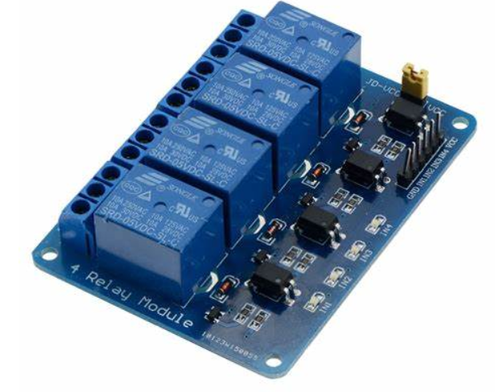

# Smart-Fish-Aquarium

 Fish keeping has become a widespread hobby and decorative trend, with people of all ages maintaining fish in various settings such as homes, offices, and commercial fish farms. There are difficulties to maintain a perfect condition for the fish to live. Coming across different peoples there are fish farmers, students, those who are in jobs etc. This group of people finds it hard to look after their aquariums or fish growing tanks due to different reasons. Due to this,  needful conditions for the fish to thrive are not given. To address the challenges of manually monitoring and maintaining aquariums, an IoT-connected system is presented. This system uses electronics to automate and control the aquarium's environment, including water conditions, lighting, automatic feeding, water filtering and water aeration. It communicates real-time status updates to a user's smartphone, significantly reducing the manual effort required for aquarium maintenance. The project helps people to access their aquariums or fish tanks from a part of the world, which helps fish farmers to look after their tanks on their own, which saves the labor charge to be given for the maintenance, with this anyone can plan for their business trips or leisure trips without being concerned about their fishes. The project utilizes an esp8266 WiFi based microcontroller as the system's control center, storing and transmitting data to a user via an Android app. This setup includes sensors for monitoring water temperature, actuators for providing wireless feeding, control to filters and lighting conditions. The command from mobile and the values from sensors are communicated to each other with the help of web servers. The result of this project aims to automation of an aquarium to make it available for users to control it in real time from any part of the world. 

# 1. What is this system?

 Increased pet ownership in India, particularly addressing the challenges faced by fish owners in leaving extra food, leading to overfeeding and fish fatality, also the unchecked conditions of the aquarium. The project aims to ensure proper fish growth and maintenance, design an automatic fish feeder, and provide real-time monitoring for aquarium, automatic tank mold cleaning, all connected to mobile applications. Pet ownership in India has seen a 14% increase over the past 29 years. For fish owners, leaving extra food in the tank during extended absences isn't feasible and can lead to overfeeding. The breakdown of excess food releases harmful substances like ammonia and nitrites, reducing oxygen levels in the water. While various feeding options exist for cats and dogs, fish owners have fewer choices. Natural food in ponds includes detritus, bacteria, and plankton, making it challenging to determine the proper amount of artificial food. This project addresses these challenges by designing an automated system that monitors water temperature, quality, cleaning and facilitates automatic fish feeding in aquaculture environments. The solutions available now are basic projects with Arduino. The products available in the market are costly. The aim of the project is to implement these functionalities at a reduced cost, also with advanced microcontrollers. Use of microcontrollers like stm32 or LPC2129 provides much faster clock speeds and faster I/O operations. Power consumption is also taken into consideration. 

# 2. Methodology

 This project helps us to feed, aerate or even control the light conditions of the aquarium from anywhere. The system includes three sockets that allow users to connect various components of their aquarium. The mobile app (Blynk IoT) is linked with the system for communication between user and components. The functions can be customisable i.e. if the user has to connect a secondary filter to the aquarium using the application, then the available sockets can be used to connect any components. It draws main power from the 240V household source, therefore any components with capability of handling 240V can be connected. 

# 3. Feedback survey

 
3.1 Literature Survey   
            Objective of the paper titled “ Aquarium Monitoring System Based on Internet of Things” defines the purpose of the system is to monitor and optimize the environment in an aquarium. It focuses on parameters such as temperature, light intensity, and water level. Components include temperature, light, ultrasonic, and infrared modules.It processes sensor data to control and optimize various outputs (e.g., lighting, water pumps) using data fusion calculations. An automatic feeder with a servo motor is integrated into the system. The feeder ensures timely and controlled feeding for the fish. Data Upload and Monitoring: Sensor data is uploaded to a back-end computer via the built-in Wi-Fi of the LinkIt 7697 module. The Cloud Sandbox platform provides real-time monitoring and enables remote network monitoring of the aquarium. In summary, this smart aquarium system combines technology, automation, and real-time monitoring to create a comfortable and safe environment for pet fish. The above proposed system is a similar system to our product.

 
3.2 Aquarium shop
             The review shared by the shopkeeper is that the customers who were buying the fishes were coming frequently to buy another pair, because before bought pairs were dead. Shopkeeper asked reviews about the fish and customers said that the fish were healthy but the conditions in which they lived did not help them to survive.He added another point that the existing systems were costly and people are not interested in buying those for high prices. Shopkeeper also acknowledged that the customers were not aware about the conditions for fishes to live and would carelessly drag them to death.

 
3.3 Review from customer
           The review shared by the customer was that he had a fish aquarium in his room but has removed it recently due to water spillage while cleaning the tank. The room went messy, each time they cleaned the aquarium. He also pointed out that a fully automated system would help to install an aquarium again, such that aquarium maintenance would be easier parallel with daily life.

 
3.4 Review from fish farm owner
              The common problem faced is when cleaning is not done frequently, fish excretions and food wastes get accumulated at the bottom of the tank. Due to this the PH level of the water changes and the water purity decreases such that it cant be used anymore to grow fishes. He suggested that if there is an automated system to feed and clean at the correct time it would sustain his fish more and could increase productivity, else the fish would eat the accumulated waste and die.

 
3.5 Online product survey
The feedback from existing products on www.amazon.in reveals a negative outlook towards these products. By meticulously analyzing these customer feedbacks, we have identified key areas for improvement and are developing our project to surpass the current offerings in the market. This approach not only addresses the immediate needs of our users but also sets a benchmark for innovation and quality in the field.The reviews from customers are shown in Fig. 1 and Fig. 2. 

          
 
# 4. BLOCK DIAGRAM

# 5. HARDWARE COMPONENT
|  COMPONENTS   |    QUANTITY   |
| ------------- | ------------- |
|    NodeMCU    |       1       |
| 4 Channel Relay switch  |     1   |
| Voltage regulator 7805  |     1   |
| Temperature sensor DS 18b20  |     1   |
| sockets  |     3   |
| 9V adapter  |     1   |
| Servo Motor  |     1   |
| Jumper Wires  |        |

# 6. COMPONENT DESCRIPTION

            
**6.1  NodeMCU esp8266**
NodeMCU is an open-source firmware designed for the ESP8266 and ESP32 WiFi system-on-chip (SoC) modules from Espressif. It simplifies the process of developing Internet of Things (IoT) applications by providing an easy-to-use platform. NodeMCU allows developers to write code in the Lua scripting language, making it accessible even to those who are not familiar with C/C++. The firmware supports WiFi connectivity, GPIO control, and includes an on-module flash-based file system called SPIFFS. NodeMCU has a vibrant community, and it’s widely used for prototyping, home automation, sensor networks, and more.It has applications in various domains. Here are some common uses for NodeMCU:
1. IoT Prototyping: NodeMCU is widely used for prototyping Internet of Things (IoT) devices. Its built-in Wi-Fi capabilities make it easy to connect to networks and cloud services.
2. Low-Power Applications: Due to its low power consumption, NodeMCU is suitable for battery-operated projects. You can create energy-efficient sensors, smart home devices, and wearable gadgets.
3. Home Security and Automation: With NodeMCU, you can create DIY security systems, monitor doors/windows, control lights, and manage appliances remotely.
4. Wireless Control Systems: NodeMCU allows you to control devices wirelessly. For example, you can build a smartphone-controlled robot or a garage door opener.
5. IP Cameras: NodeMCU can interface with cameras and stream video over Wi-Fi. You can set up your own IP camera system for surveillance.

     

 

The microcontroller works on a power supply of 5V. It has 13 GPIO pins as shown in Fig. 5. A GPIO is a general purpose input/output pin, through which we can set values of output pins and we can even read values of input pins. The GPIO pins can be digitally programmed so that they can be turned ON or OFF. The output of any GPIO pin is 3.3v and can be used to control output components like an LED or a motor. These ON/OFF conditions can also be interpreted as a Boolean True/False, 1/0 or HIGH/LOW. It has two serial communication ports. Three 3.3V power out pins. The controller executes programs with a clock speed of 80MHz. Then there are the ground pins. There are four ground pins and all of these are connected to each other; you can use any of these ground pins for your projects. These are the common types of pins on a NodeMCU board. 

       

 

            
**6.2  4 Channel relay switch**
A 4-channel relay module is a versatile electronic device that allows you to control multiple electrical circuits using a microcontroller or other digital input signals. It is an active low switch i.e it turns ON if value 0 is passed and turns OFF when value 1 is passed. Toggling of switches is done by passing a 5V signal, a 3.3V signal can also be passed to switch relays

 

The module has 4 screw terminal blocks for the motor four plugs, The positive from main power supply (240V) is commonly given to common contact screws, this makes each relay ready with 240V supply. Now the components are connected to normally open pins, such that when an activation pulse is given to the corresponding relay through the input pin as shown in Fig. 7., the switch falls and current gets running through the components (filter,light,aeration…etc). This is how the connection is made in the relay module. In the 4 channel relay switch there are 4 pins for inputs namely, IN0. IN1, IN2, IN3. These are the four inputs for four relays.

 

The 5V relay module pinout consists of connections on the input side, where it receives the trigger signal, and the output side, where it controls the load. Vcc: The power supply connection, usually 5V. GND: The ground connection. IN: The input signal connection, which receives the trigger signal. NC (Normally Closed) and NO (Normally Open) connections: These are the output connections that control the load.

            
**6.3  Voltage Regulator 7805**
The 7805 voltage regulator is a popular integrated circuit (IC) designed to maintain a constant output voltage of 5V despite changes in input voltage and load. It is a positive voltage regulator, meaning it ensures a stable +5V output voltage. This IC is widely used in various electronic circuits, including regulated power supplies and limiting circuits. It has output voltage: 5V, output current: 1.5A, input voltage: 7V to 25V, internal thermal overload and short-circuit current limiting protection, through-hole mounted.Some applications of voltage regulators are
Regulated power supplies
- Limiting circuits
- Electronic devices, such as LED, monitors, electric locks, medical instruments, and switches
- Arduino and other microcontroller projects

The 7805 voltage regulator has three pins as shown in Fig. 8. Input pin (VIN): accepts the input DC voltage. Ground pin (GND): connects to the ground reference. Output pin (VOUT): provides the regulated 5V output voltage. When using a 7805 voltage regulator, we must ensure that the input voltage does not exceed the maximum rating (25V) and that the output current does not exceed the maximum rating (1.5A). If these requirements are not followed, it may result in overheating, malfunctioning, or even damage to the IC.

            
**6.4   Servo motor**
A servo motor is an electric motor that provides precise control of angular or linear    position, speed, and torque using a feedback loop system. It is a type of motor that allows for precise control of movement, making it widely used in various applications such as robotics, automation, and precision machinery.
Main components of a Servo Motor: A motor, a suitable motor that provides the necessary torque and speed for the application.A Sensor, sensor that provides feedback on the motor’s position, speed, and acceleration.A Controller, a controller that regulates the motor’s movement according to a desired setpoint, using advanced control systems like PID and fuzzy logic.

 

Working of Servo Motor : A control signal is sent to the servo motor, specifying the desired position, speed, and acceleration. The motor moves to the desired position, speed, and acceleration based on the control signal. The sensor provides a feedback signal to the controller, indicating the motor’s actual position, speed, and acceleration. The controller adjusts the motor’s movement based on the feedback signal, ensuring that the motor reaches the desired position, speed, and acceleration.
Some applications of Servo Motors : Servo motors are widely used in robotics to provide precise control of movement and positioning. Servo motors are used in industrial automation to control the movement of parts and mechanisms. Servo motors are used in precision machinery, such as CNC machines and 3D printers, to provide precise control of movement and positioning.

            
**6.5   Temperature sensor DS18b20**
The DS18B20 is a digital temperature sensor that uses a 1-Wire interface to communicate with a central microprocessor. It is a waterproof and stainless steel temperature probe that can operate in extreme conditions, making it suitable for various applications such as liquid, freezer, fridge, and cold storage. It is waterproof and stainless steel construction, 1-Wire digital temperature sensor, operating temperature range: -55°C to 125°C, high-quality stainless steel probe, IP68 rating for water resistance, unique silicon serial number for verification and multiple sensor connection.
The DS18B20 temperature sensor can be used with various microcontrollers, including Arduino, NodeMCU to measure temperature. It is a popular choice for projects that require accurate temperature monitoring, such as home automation, industrial control systems, and scientific research.
Some advantages of this sensor are :Simple installation and connection using a single wire, high accuracy and reliability, waterproof and durable construction, suitable for a wide range of temperatures and applications. It has 3 pins as shown in Fig. 10. A vdd pin to give power to the sensor, a ground pin, a data pin which sends data about the temperature. Using specific functions in Arduino IDE it is possible to fetch temperature in degrees as well as in fahrenheit.

       

The DS18B20 temperature sensor is a reliable and accurate digital temperature sensor that is suitable for various applications. Its waterproof and stainless steel construction make it a great choice for projects that require temperature monitoring in harsh environments.

 
            
**6.6   Power supply and adapter**
Power supply is taken mainly from wall sockets which give power of 220V-240V. A 9 volt adapter is used, and the 9V is converted to 5V output using a 7805 voltage regulator which powers the microcontroller and servo motor. The main power of 240V is used for working of other connected components.

            
**6.7   Plug holders**
Plug holders to connect aquarium components with the controlling device. Type of plug holders can be changed according to the user's need. Introduction of plug holders helps user to connect and control any type of electric devices.

            
**6.8   Jumper Wire**
A jump wire is an electrical wire, or group of them in a cable, with a connector or pin at each end, which is normally used to interconnect the components of a breadboard or other prototype or test circuit, internally or with other equipment or components, without soldering.

# 7. FUNCTIONAL DIAGRAM

# 8.SOFTWARE REQUIREMENTS

            
**8.1  Arduino IDE 2.3.2**
               The Arduino IDE is a popular tool among hobbyists and professionals alike for developing and uploading code to Arduino boards. It supports various versions, the version used in this project is 2.3.2, which is the latest version. It has significant improvements over the previous versions. It is an open source platform, and its source code is hosted on GitHub. This allows for active development and contributions from the community.It can be used with any Arduino board, making it versatile for a wide range of projects. This project was programmed in Arduino IDE which is compatible with NodeMCU, for setting up this we imported NodeMCU board.
            

            
**8.2  LANGUAGE USED - Arduino programming language**
             The language used in the Arduino IDE is essentially a variant of C/C++. It is often referred to as the Arduino Programming Language or simply Arduino Language. This language is based on the Wiring development platform, which itself was inspired by Processing. The Arduino Programming Language is fundamentally a framework built on top of C++. While it might not strictly adhere to the traditional definition of a programming language, it serves as a simplified and specialized version of C/C++ tailored for embedded systems programming. Programs written in the Arduino Programming Language are organized into sketches, which are typically saved with the .ino file extension.

            
# 9.  RESULT
Designed and implemented Automation of Fish aquarium. Successfully implemented the concept of feeding and cleaning unit from the instruction from mobile application. Successfully monitored water temperature, displayed the temperature in the mobile app. Controlled Filter and light from the mobile app. Automatically fed the fish with an automatic fish feeder unit. Tested whether the system is working from kilometers away.  

            
# 10. CONCLUSION
This project gives us an approach towards easy access to Fish aquarium components. This project is helpful when the user is away from the aquarium and needs to access the aquarium's filter, light, air pump etc. This project stands out from other projects in the unique functions like fish feeding unit and automatic cleaning function. Implementing these functions at a relatively lower price than the products currently available in the market makes the product more compatible for normal use. It also helps fish farmers to look after their fishes on their own without the help of any external labor costs. The system has multiple plug points which allows the user to connect any of their fish aquariums.

# 11. FUTURE SCOPE
The integration of smart features such as smartphone connectivity and remote monitoring is becoming increasingly common. This allows aquarium owners to control and monitor their fish feeders remotely, ensuring their pets receive proper care even when they are away from home. Advanced feeders are being developed with precision feeding capabilities, ensuring that fish receive exactly the right amount of food at the right times. These functions can be controlled remotely with the implementation of this project. The popularity of aquarium hobbies and the increasing demand for aquaculture products are driving the need for efficient feeding solutions.In conclusion, the future of fish aquarium automation looks bright, with significant growth potential driven by technological advancements, expanding market opportunities, and the need for innovative solutions. Companies that can successfully navigate the challenges and capitalize on the opportunities presented will be well-positioned to lead in this dynamic market. The system can be implemented as a social enterprise system to help out the fish farmers to maintain their quality of fishes by adding a few sensors like dissolved Oxygen sensor, pH sensor, turbidity sensor, salinity sensor etc. Furthermore the system helps farmers to control farms on their own, which reduces their labor cost and grow their profit efficiently.

